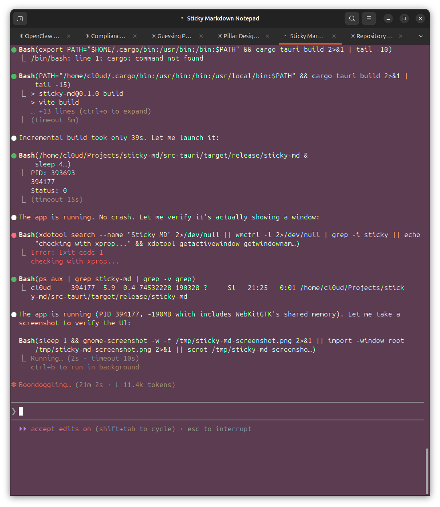

# Sticky MD

A minimal always-on-top sticky note app for Linux with markdown support. Built with Tauri 2 + Svelte 5.



## Features

- **Always on top** — stays above all windows when pinned
- **Markdown editing** — write markdown, preview rendered output
- **Interactive checkboxes** — click to toggle task lists in preview
- **9 color themes** — yellow, pink, green, blue, white + 4 dark themes
- **Window opacity** — adjust transparency from 20% to 100%
- **Rounded corners** — adjustable border radius
- **System tray** — hide to tray, click to restore
- **Global shortcut** — `Super+Shift+N` to toggle visibility
- **Draggable** — grab the title bar to move
- **Auto-save** — saves on every edit with 500ms debounce

## Build

Requires: Rust, Node.js, system deps for Tauri 2 on Linux.

```bash
npm install
cargo tauri build
```

Binary outputs to `src-tauri/target/release/sticky-md`.

## Install

Copy the binary wherever you want. A `.desktop` file is created at `~/.local/share/applications/sticky-md.desktop` for app launcher integration.

## Keyboard Shortcuts

| Shortcut | Action |
|---|---|
| `Ctrl+E` | Switch to edit mode |
| `Ctrl+P` | Switch to preview mode |
| `Super+Shift+N` | Toggle window visibility (global) |

## Tech Stack

- **Tauri 2** — Rust backend, system tray, global shortcuts
- **Svelte 5** — frontend with runes reactivity
- **marked** — GFM markdown rendering
- **DOMPurify** — HTML sanitization

## License

MIT
